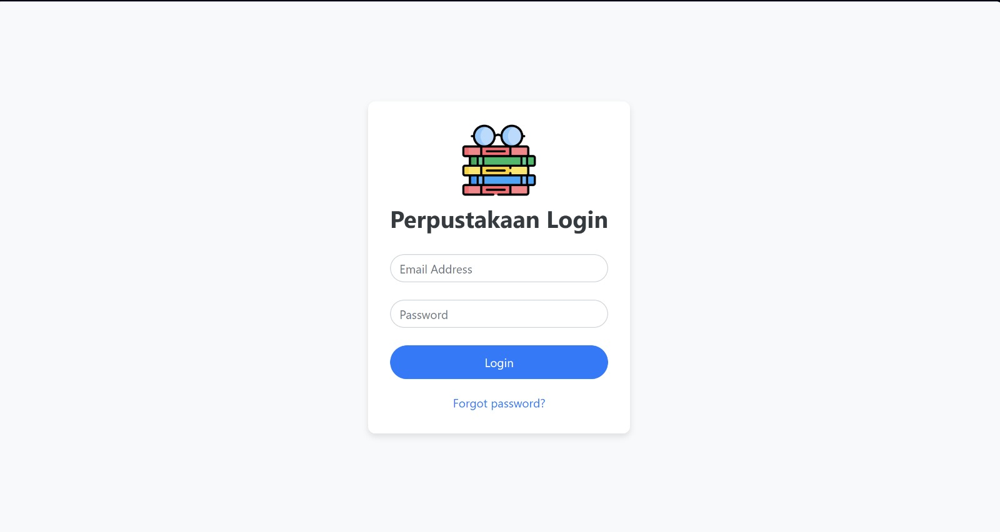
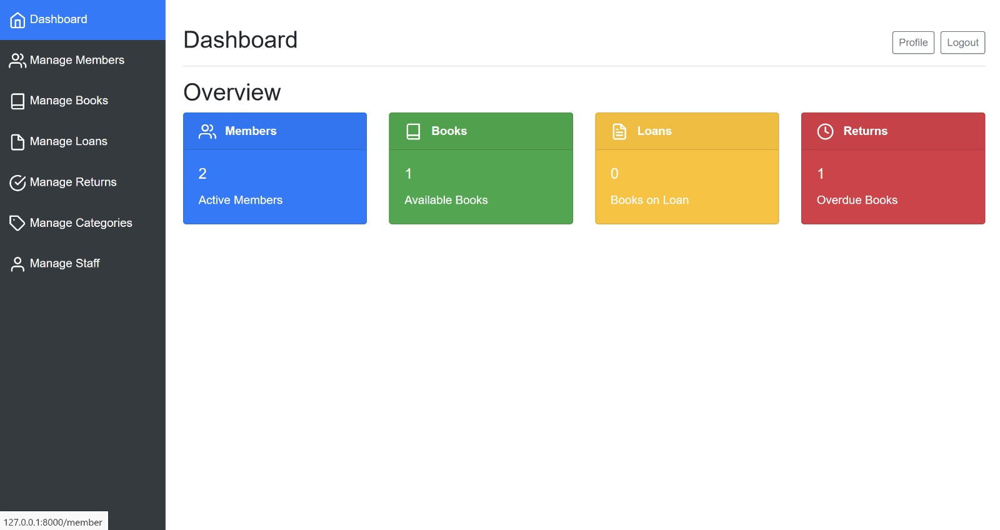
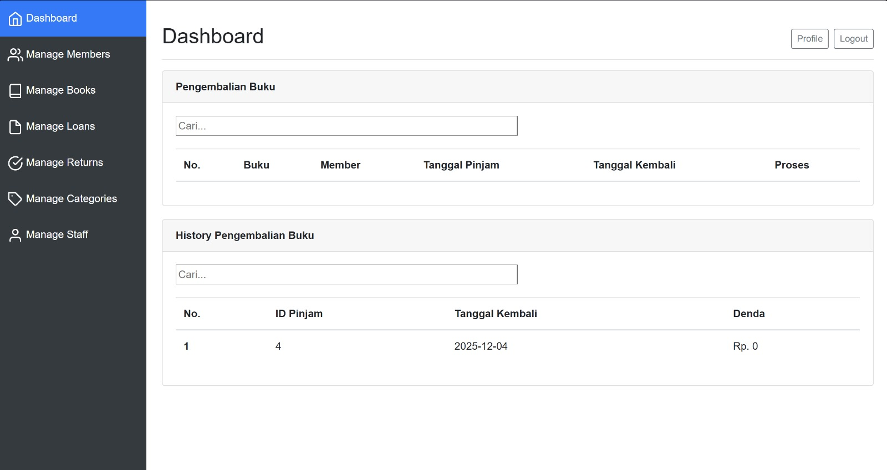
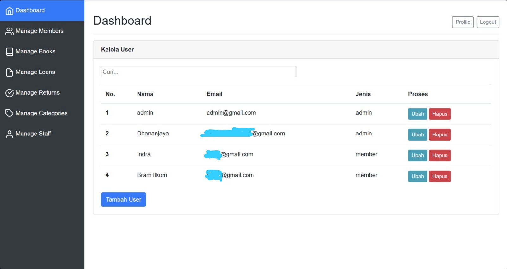

# Library Management Dashboard (Sistem Informasi Perpustakaan)


A modern, responsive **Library Management Dashboard** built to streamline library operations. This application allows efficient management of books, members, admins, and circulation processes (borrowing and returning) with a dynamic user interface powered by **Livewire** and **Bootstrap**.

## 📖 Table of Contents
- [About the Project](#-about-the-project)
- [Key Features](#-key-features)
- [Tech Stack](#-tech-stack)
- [Requirements](#-requirements)
- [Installation](#-installation)
- [Screenshots](#-screenshots)
- [License](#-license)

## ℹ️ About the Project
This project is designed to help librarians or administrators manage library resources effectively. By using **Laravel Livewire**, the application offers a "Single Page Application" (SPA) feel without the complexity of a separate frontend framework, ensuring fast interactions like real-time searching and dynamic form validation.

## 🌟 Key Features

### 📚 Master Data Management
* **Book Management (Data Buku):**
    * CRUD (Create, Read, Update, Delete) operations for books.
    * Manage details like Title, ISBN, Author, Publisher, Stock, and Category.
    * Real-time search and filtering.
* **Member Management (Data Member):**
    * Register and manage library members/students.
    * View member borrowing history.
* **Admin Management:**
    * Manage system administrators and staff access.

### 🔄 Circulation (Sirkulasi)
* **Borrowing (Peminjaman):**
    * Record new loans with due dates.
    * Automatic stock reduction when a book is borrowed.
    * Validation to prevent members from borrowing beyond limits.
* **Returning (Pengembalian):**
    * Process book returns.
    * Automatic fine calculation (Denda) for late returns (optional feature).
    * Update book stock status automatically.

### 📊 Dashboard & Reports
* **Real-time Stats:** View total books, active members, and ongoing loans at a glance.
* **Transaction History:** Logs of all borrowing and returning activities.

## 🛠 Tech Stack
* **Framework:** [Laravel 12](https://laravel.com)
* **Full-Stack Framework:** [Livewire 3.7](https://livewire.laravel.com) (for dynamic components)
* **Styling:** [Bootstrap 4.5](https://getbootstrap.com)
* **Database:** MySQL
* **Icons:** Bootstrap Icons / FontAwesome

## 💻 Requirements
Before running this project, ensure you have the following installed:
* PHP >= 8.1
* Composer
* MySQL / MariaDB
* Node.js & NPM (for compiling assets)

## 🚀 Installation

1.  **Clone the Repository**
    ```bash
    git clone https://github.com/IGDhananjaya/web-perpustakaan.git
    cd library-dashboard
    ```

2.  **Install Dependencies**
    ```bash
    composer install
    npm install
    ```

3.  **Environment Setup**
    Copy the `.env` file and configure your database credentials:
    ```bash
    cp .env.example .env
    ```
    Open `.env` and set your DB details:
    ```env
    DB_CONNECTION=mysql
    DB_HOST=127.0.0.1
    DB_PORT=3306
    DB_DATABASE=library_db
    DB_USERNAME=root
    DB_PASSWORD=
    ```

4.  **Generate App Key**
    ```bash
    php artisan key:generate
    ```

5.  **Run Migrations & Seeders**
    Create tables and insert dummy data (admin accounts, sample books):
    ```bash
    php artisan migrate --seed
    ```

6.  **Build Assets**
    ```bash
    npm run build
    ```

7.  **Run the Server**
    ```bash
    php artisan serve
    ```
    Access the app at `http://127.0.0.1:8000`

## 📸 Screenshots

| Login | Dashboard |
| :---: | :---: |
|  |  |

| Return Form | Member List |
| :---: | :---: |
|  |  |

## 👥 Author
**I Gede Dhananjaya**
**Institution:** Universitas Pendidikan Ganesha


## 📄 License
This project is open-sourced software licensed under the [MIT license](https://opensource.org/licenses/MIT).
